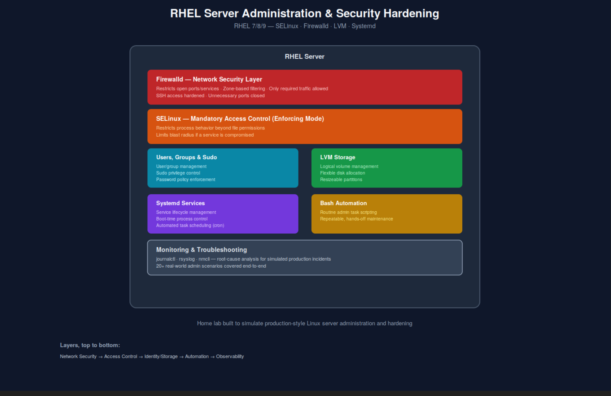

# Rhel-Admin-Lab
RHEL server hardening and administration — SELinux (enforcing mode), Firewalld, LVM storage, and Systemd/Bash automation across 20+ real-world scenarios.
# RHEL Server Administration & Security Hardening

A hands-on home lab covering RHEL installation, security hardening, storage management, and automation — simulating the kind of day-to-day Linux administration and incident troubleshooting required in production environments.

## Overview

A default Linux server install is not production-safe — open ports, permissive access, and no mandatory access control leave it exposed. This project hardens a RHEL server from a default install to a security-conscious, well-managed baseline, while building the operational habits (automation, monitoring, incident response) needed to run it reliably.

## What I Built

**Identity & Storage**
- Installed and configured RHEL 7/8/9 environments, managing users, groups, and permissions
- Configured LVM-based storage for flexible, resizeable disk allocation

**Security Hardening**
- Configured SELinux in enforcing mode to apply mandatory access control, limiting what processes can do even if compromised
- Set up Firewalld rules to restrict open ports/services to only what's necessary
- Enforced sudo privilege control and password policy

**Automation**
- Automated routine administrative tasks using Bash scripting
- Managed service lifecycle and boot-time processes with Systemd
- Scheduled recurring tasks via cron

**Monitoring & Troubleshooting**
- Simulated production incidents and practiced root-cause analysis using `journalctl`, `rsyslog`, and `nmcli`
- Built a home lab covering 20+ real-world admin scenarios: storage, LVM, SELinux contexts, Firewalld, cron, SSH, networking, service management, and log-based troubleshooting

## Technologies Used

`RHEL 7/8/9` `SELinux` `Firewalld` `LVM` `Systemd` `Bash` `Sudo` `journalctl` `rsyslog` `nmcli`

## Key Highlights

- Security hardening goes beyond default install — SELinux enforcing mode + Firewalld, not just one or the other
- Operational discipline: automation and monitoring built in from the start, not bolted on afterward
- 20+ scenario-based lab exercises, covering the range of day-to-day admin work rather than a single narrow task

---
📄 Full write-up and diagram also available on my [portfolio](https://rohanportfolio.online)
